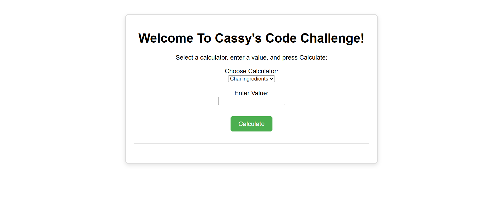

# Code Challenge 1 – JavaScript Calculators

This project contains solutions to three JavaScript-based coding challenges for Week 1.

By **Cassy Omondi**

## Description

Three mini-calculators built using JavaScript to practice function creation, user interaction, and basic DOM manipulation. The calculators are:
- **Chai Bora Ingredient Calculator**
- **Boda Boda Fare Estimator**
- **Mobile Money Transaction Fee Estimator**

Each calculator demonstrates the use of core JavaScript concepts like variables, conditionals, functions, and input handling.

## Screenshot



## Features

- Easy-to-use dropdown to select one of the three calculators
- Real-time input and result display
- Clear, user-friendly output formatting
- Responsive and clean layout (basic styling with CSS)

## How to Use

### Requirements
- A computer, phone, or tablet
- A modern web browser (Chrome, Firefox, Edge, Safari)

### View Live Site

Visit the deployed application at: **https://cassyomondi.github.io/Code-Challenge-1/**

You can:
- Choose a calculator (Chai, Boda, or Transaction Fee)
- Input a value
- Press **"Calculate"** to view the result

### Local Development

If you'd like to run the project locally:

#### 1. Clone the repository:
```bash
git clone https://github.com/cassyomondi/Code-Challenge-1.git

Or download the ZIP and extract it.
```

#### 2. Navigate to the project folder:
```bash
cd code-challenge-1
```

#### 3. Open index.html in your browser:
You can double-click index.html, or use a live server extension in VS Code and visit http://localhost:5500

 --- 
 
# Author

Cassy Omondi

# License

MIT License

Copyright © 2025 Cassy Omondi

Permission is hereby granted, free of charge, to any person obtaining a copy of this software and associated documentation files (the "Software"), to deal in the Software without restriction, including without limitation the rights to use, copy, modify, merge, publish, distribute, sublicense, and/or sell copies of the Software, and to permit persons to whom the Software is furnished to do so, subject to the following conditions:

The above copyright notice and this permission notice shall be included in all copies or substantial portions of the Software.

THE SOFTWARE IS PROVIDED "AS IS", WITHOUT WARRANTY OF ANY KIND, EXPRESS OR IMPLIED, INCLUDING BUT NOT LIMITED TO THE WARRANTIES OF MERCHANTABILITY, FITNESS FOR A PARTICULAR PURPOSE AND NONINFRINGEMENT. IN NO EVENT SHALL THE AUTHORS OR COPYRIGHT HOLDERS BE LIABLE FOR ANY CLAIM, DAMAGES OR OTHER LIABILITY, WHETHER IN AN ACTION OF CONTRACT, TORT OR OTHERWISE, ARISING FROM, OUT OF OR IN CONNECTION WITH THE SOFTWARE OR THE USE OR OTHER DEALINGS IN THE SOFTWARE.
